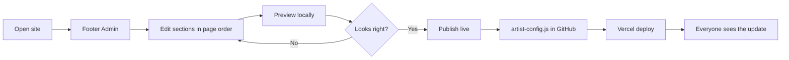

<p align="center">
  
</p>

<p align="center">
  <strong>A cinematic artist EPK template with simple browser admin, share cards, reels, headshots and Vercel publishing.</strong>
</p>

<p align="center">
  <a href="https://artistpass.vercel.app"><strong>Live Site</strong></a>
  ·
  <a href="#screenshots"><strong>Screenshots</strong></a>
  ·
  <a href="#admin-flow"><strong>Admin Flow</strong></a>
  ·
  <a href="#deploy"><strong>Deploy</strong></a>
</p>

<p align="center">
  
  
  
  
</p>

## What It Is

ArtistPass is a share-ready profile website for actors, singers, creators and performers who need a polished portfolio without a heavy CMS. It gives them a cinematic public page, a simple admin panel, downloadable materials, and share flows that work for casting and production conversations.

The current profile is a sample fictional artist. Swap the config, images and reel links to make a new artist site.

## Screenshots

<p align="center">
  
</p>

<p align="center">
  
  
</p>

## Why This Base Works

| Need | ArtistPass approach |
| --- | --- |
| Fast launch | Static `index.html`, no build pipeline required. |
| Non-technical edits | Admin panel follows the page order and writes a config file. |
| Shared live updates | `Publish live` can write `artist-config.js` to GitHub through a Vercel API route. |
| Casting workflow | Role-fit cards, reel section, headshots, resume, casting card image/PDF and share messages. |
| Low maintenance | No database by default. Media can live in the repo, YouTube, Google Drive, Cloudinary or Vercel Blob. |

## Features

- Cinematic first screen with profile CTA buttons.
- Role-fit dossier for casting context.
- Reel carousel with matching clips.
- Headshot gallery with one-click image downloads.
- Casting card image and PDF export.
- Resume PDF download.
- Native share flows with editable message templates.
- Browser admin panel with local preview and live publishing.
- SEO/AEO basics: canonical URL, social preview image, JSON-LD, sitemap and robots file.

## Admin Flow



Admin is deliberately simple:

- **Preview locally** changes only your current browser.
- **Publish live** pushes the config to GitHub and lets Vercel deploy it.
- Images and videos are link/path based. For full uploads, add Cloudinary or Vercel Blob behind authentication.

## Project Structure

```text
.
├── api/publish-config.js       # Optional GitHub publisher for Admin
├── artist-config.js            # Published content override
├── downloads/                  # Resume and generated static downloads
├── docs/                       # README logo and screenshots
├── portfolio/demo-ananya/      # Sample profile images and short clips
├── index.html                  # Site, admin panel and runtime logic
├── support.js                  # Runtime dependency
├── robots.txt
├── sitemap.xml
└── vercel.json
```

## Local Use

Serve the folder with any static server:

```bash
python -m http.server 4177
```

Then open:

```text
http://127.0.0.1:4177/
```

## Deploy

Vercel settings:

- Framework preset: **Other**
- Build command: none
- Output/root: repo root

If you use the Admin publish route, add these Vercel environment variables.
The website loads `/api/config` at runtime, so Admin updates can appear on refresh without waiting for a full Vercel redeploy.

| Variable | Purpose |
| --- | --- |
| `ADMIN_PUBLISH_PASSWORD` | Server-side publish password. |
| `GITHUB_TOKEN` | GitHub token with contents read/write access to this repo. |
| `GITHUB_REPO` | Optional. Defaults to `eyeinthesky6/artistpass-epk-demo`. |
| `GITHUB_BRANCH` | Optional. Defaults to `main`. |
| `GITHUB_COMMITTER_NAME` | Optional commit identity. |
| `GITHUB_COMMITTER_EMAIL` | Optional commit email. |

## Media Guidance

ArtistPass is a link/path editor by default, not a full media storage backend.

- Public reels: YouTube unlisted is the easiest playback option.
- Private/restricted clips: Google Drive links are simple and less publicly searchable, but anyone with the link can forward them.
- Controlled sharing: DocSend-style tools add passcodes, expiry, viewer verification, download controls and analytics.
- Images/headshots: committed files in `portfolio/` are simplest.
- Future direct uploads: use Cloudinary or Vercel Blob with authentication, size limits and optimization.

## Template Directions

This base can support more than one vertical:

- Actor/artist EPK: current layout, reels, role fits, share card.
- Singer/musician EPK: audio/video reel, genres, set list, booking CTA.
- Founder/expert profile: proof, talks, press, advisory fit, lead capture.
- Fictional character profile: character dossier, lore gallery, teaser clips and future game hooks.

## License Note

The sample profile, images and clips are placeholder/demo materials for showing the template flow. Replace them before using the template for a real artist or public client project.
