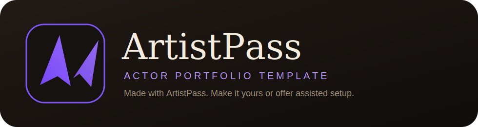
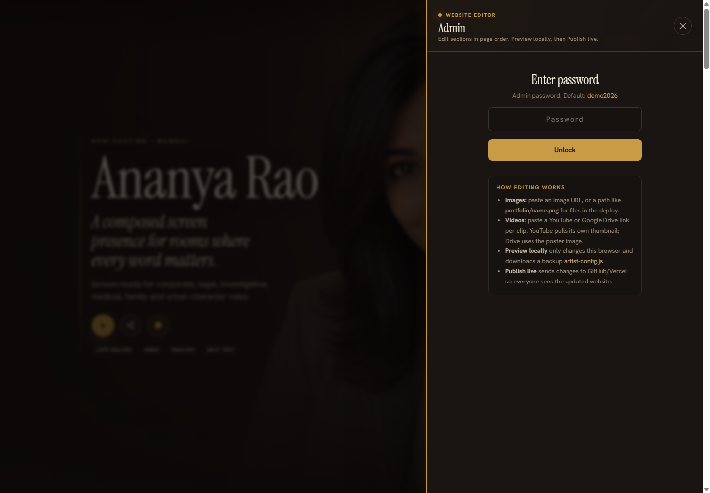
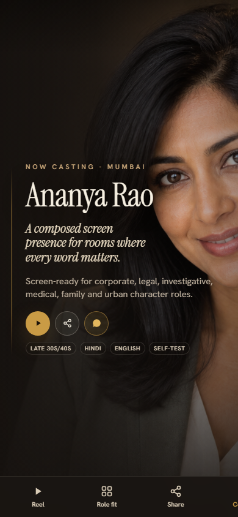
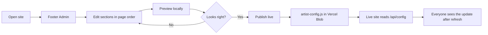

<p align="center">
  
</p>

<p align="center">
  <strong>A self-managed actor portfolio website and artist EPK template with showreel, headshots, casting card, resume and browser Admin publishing.</strong>
</p>

<p align="center">
  <a href="https://artistpass.vercel.app"><strong>Live Site</strong></a>
  ·
  <a href="https://vercel.com/new/clone?repository-url=https%3A%2F%2Fgithub.com%2Feyeinthesky6%2Fartistpass&project-name=artistpass&repository-name=artistpass&env=ADMIN_PUBLISH_PASSWORD&envDescription=Choose+a+private+Admin+password.+This+password+unlocks+Publish+live+and+uploads+in+your+ArtistPass+admin+panel.&envLink=https%3A%2F%2Fgithub.com%2Feyeinthesky6%2Fartistpass%23admin-flow&demo-title=ArtistPass+-+Actor+Portfolio+Website+%26+Artist+EPK&demo-description=Self-managed+actor+portfolio+website+with+showreel%2C+headshots%2C+casting+card%2C+resume+and+browser+Admin+publishing.&demo-url=https%3A%2F%2Fartistpass.vercel.app&demo-image=https%3A%2F%2Fartistpass.vercel.app%2Fdocs%2Fscreenshots%2Fartistpass-home.png&stores=%5B%7B%22type%22%3A%22blob%22%2C%22access%22%3A%22public%22%7D%5D"><strong>Make It Yours</strong></a>
  ·
  <a href="#screenshots"><strong>Screenshots</strong></a>
  ·
  <a href="#admin-flow"><strong>Admin Flow</strong></a>
  ·
  <a href="docs/ONE_CLICK_DEPLOY.md"><strong>One-Click Setup</strong></a>
  ·
  <a href="docs/BUSINESS_PLAN.md"><strong>Business Plan</strong></a>
  ·
  <a href="#deploy"><strong>Deploy</strong></a>
</p>

<p align="center">
  
  
  
  
  
  
</p>

## Table Of Contents

- [What It Is](#what-it-is)
- [Quick Decision](#quick-decision)
- [Quick Start](#quick-start)
- [Screenshots](#screenshots)
- [Market Language](#market-language)
- [Why This Base Works](#why-this-base-works)
- [Admin Flow](#admin-flow)
- [Deploy](#deploy)
- [Media Guidance](#media-guidance)
- [Distribution](#distribution)
- [Template Directions](#template-directions)
- [Contributing](#contributing)
- [License](#license)

## What It Is

ArtistPass is a share-ready actor portfolio website and artist EPK template for actors, singers, creators, models, dancers, musicians and performers who need a polished profile without a heavy CMS. It gives them a cinematic public page, showreel/reel section, headshots, casting profile, resume/CV, simple admin panel, downloadable materials, and share flows that work for casting, booking and production conversations.

The current profile is a sample fictional artist. Swap the config, images and reel links to make a new artist site.

## Quick Decision

| You are | Use ArtistPass for |
| --- | --- |
| Actor, singer or performer | A portfolio website with showreel, headshots, resume/CV, casting card and share-ready contact flows. |
| Website maker or agency | A reusable portfolio website template you can deploy, customize and hand over without running a heavy CMS. |
| Developer | A small static/Vercel Blob reference for browser-admin publishing, uploads and share cards. |
| Creator founder | A proof project showing how to package a useful site as a GitHub/Vercel template. |

## Quick Start

1. Open the [live demo](https://artistpass.vercel.app).
2. Click **Make It Yours** to clone and deploy on Vercel.
3. Choose an `ADMIN_PUBLISH_PASSWORD` during setup.
4. Open the deployed site, go to **Admin**, replace the sample profile, then click **Publish live**.

For non-technical artists, use the assisted path: deploy once for them, give them the website link, Admin link and password, and let them handle routine text/image/PDF updates from the browser.

## Current Status

- **Live demo:** `https://artistpass.vercel.app`
- **Repo:** public GitHub template repo, ready for Vercel clone/deploy.
- **Self-serve path:** click **Make It Yours**, choose an Admin password, deploy on Vercel, then edit from the website Admin panel.
- **Assisted path:** deploy once for a non-technical artist, hand them the website link, Admin link and password.
- **Distribution path:** GitHub template and live demo are ready. Vercel Templates are optional; see [DISTRIBUTION_PLAN.md](docs/DISTRIBUTION_PLAN.md).
- **Latest UAT:** hero, mobile nav, role filters, reel playback, footer socials, downloads, SEO files, Admin guidance and deploy button checked on the live site.

## Screenshots

<p align="center">
  
</p>

<p align="center">
  
  
</p>

## Market Language

Use the clean brand name **ArtistPass**, but keep these market terms in public copy, docs, tags and SEO:

- **Actors and casting:** actor portfolio website, acting portfolio, actor profile, casting profile, casting card, showreel, demo reel, headshots, actor resume, actor CV, Mumbai actor profile, India actor website.
- **Singers and performers:** artist portfolio website, singer portfolio, musician website, music portfolio, artist EPK, electronic press kit, press kit, media kit.
- **Developers and marketplaces:** portfolio website template, personal portfolio website, creator website, no-code admin, self-managed website, Vercel template, static site, Vercel Blob.

`EPK` is useful for musicians, singers and press-kit searches. For Indian actors, clearer words are usually **portfolio**, **profile**, **showreel**, **headshots**, **casting** and **resume/CV**. So `EPK` stays in keywords and docs, but not in the main repo name.

## Why This Base Works

| Need | ArtistPass approach |
| --- | --- |
| Fast launch | Static `index.html`, no build pipeline required. |
| Non-technical edits | Admin panel opens one page section at a time, with simple upload buttons and live publishing. |
| Shared live updates | `Publish live` writes the live config to Vercel Blob, with GitHub fallback for older installs. |
| Casting workflow | Role-fit cards, showreel/reel section, headshots, actor resume/CV, casting card image/PDF and share messages. |
| Low maintenance | No database and no heavy CMS. Images/PDFs can upload to Vercel Blob; videos can stay on YouTube, Google Drive or another host. |

## Features

- Cinematic first screen with profile CTA buttons.
- Role-fit dossier for casting context.
- Showreel / demo reel carousel with matching clips.
- Headshot gallery with one-click image downloads.
- Casting card image and PDF export.
- Actor resume/CV PDF download.
- Native share flows with editable message templates.
- Browser admin panel with one-section editing, local preview, favicon/image/PDF uploads and live publishing.
- SEO/AEO basics: canonical URL, social preview image, JSON-LD, sitemap and robots file.

## Admin Flow



Admin is deliberately simple:

- **Preview locally** changes only your current browser.
- **Publish live** pushes the config to Vercel Blob. The live site reads the latest config on refresh.
- **Upload** buttons store favicon/images/PDFs in Vercel Blob and place the URL into the right field.
- Common items are edited once: the main headshot drives the casting card and normal share preview, while contact details drive footer/contact/share text.
- Videos stay link-based for now. Use YouTube, Google Drive, Vimeo or another video host, then paste the link.

## From Discovery To Use

The simplest user journey is:

1. A creator, artist or manager sees the demo or GitHub page.
2. They click **Make It Yours** or ask for an assisted setup.
3. Vercel creates their project, asks for a private Admin password, and connects Blob storage.
4. They open their live site, click **Admin**, enter the same password, and update the page section by section.
5. They upload images/PDFs or paste reel links from YouTube, Google Drive, Vimeo or another host.
6. They use **Preview locally** to check changes in their own browser.
7. They click **Publish live** so everyone sees the update after refresh.
8. They share the profile, casting card, reel links or contact card from the public site.

For DIY users, this is a Vercel one-click template. For non-technical users, the cleanest path is assisted setup: they never need to touch GitHub. They only use Admin after the site is live.

## Project Structure

```text
.
├── api/config.js               # Runtime config loader
├── api/publish-config.js       # Admin publisher: Blob first, GitHub fallback
├── api/upload.js               # Password-protected Blob uploads for images/PDFs
├── artist-config.js            # Published content override
├── downloads/                  # Resume and generated static downloads
├── docs/                       # README logo and screenshots
├── portfolio/demo-ananya/      # Sample profile images and short clips
├── index.html                  # Site, admin panel and runtime logic
├── support.js                  # Runtime dependency
├── robots.txt
├── sitemap.xml
└── vercel.json
```

## Local Use

Serve the folder with any static server:

```bash
python -m http.server 4177
```

Then open:

```text
http://127.0.0.1:4177/
```

## Deploy

Fastest setup:

<p>
  <a href="https://vercel.com/new/clone?repository-url=https%3A%2F%2Fgithub.com%2Feyeinthesky6%2Fartistpass&project-name=artistpass&repository-name=artistpass&env=ADMIN_PUBLISH_PASSWORD&envDescription=Choose+a+private+Admin+password.+This+password+unlocks+Publish+live+and+uploads+in+your+ArtistPass+admin+panel.&envLink=https%3A%2F%2Fgithub.com%2Feyeinthesky6%2Fartistpass%23admin-flow&demo-title=ArtistPass+-+Actor+Portfolio+Website+%26+Artist+EPK&demo-description=Self-managed+actor+portfolio+website+with+showreel%2C+headshots%2C+casting+card%2C+resume+and+browser+Admin+publishing.&demo-url=https%3A%2F%2Fartistpass.vercel.app&demo-image=https%3A%2F%2Fartistpass.vercel.app%2Fdocs%2Fscreenshots%2Fartistpass-home.png&stores=%5B%7B%22type%22%3A%22blob%22%2C%22access%22%3A%22public%22%7D%5D">
    
  </a>
</p>

The button clones the template, creates a Vercel project, asks for the Admin password, and connects a public Blob store for live config and admin uploads.

After deployment:

1. Open the Vercel URL.
2. Scroll to the footer and click **Admin**.
3. Enter the Admin password you chose during deployment.
4. Replace the sample profile section by section.
5. Click **Preview locally** to check your browser.
6. Click **Publish live** so everyone sees the update.

No-GitHub user path:

- For a non-technical artist, treat setup as an assisted service. They do not need to know GitHub.
- You deploy the template once, give them the website link, admin link and password.
- After that, they use Admin to edit text, upload images/PDFs and publish live from the browser.
- If they want their own domain, buy/connect it in Vercel, then set it as the project domain. Routine website edits still happen from Admin.

Self-serve note: Vercel's clone button usually expects the person deploying to connect a Git provider. That is fine for makers, but it is not the easiest promise for artists who do not want technical accounts.

Vercel settings:

- Framework preset: **Other**
- Build command: none
- Output/root: repo root

If you set up manually, add these Vercel environment variables.
The website loads `/api/config` at runtime, so Admin updates can appear on refresh without waiting for a full Vercel redeploy.

| Variable | Purpose |
| --- | --- |
| `ADMIN_PUBLISH_PASSWORD` | Server-side publish password. |
| `BLOB_READ_WRITE_TOKEN` | Preferred. Enables live config plus admin image/PDF uploads. Added automatically when a Vercel Blob store is connected. |
| `GITHUB_TOKEN` | Optional fallback. GitHub token with contents read/write access to this repo. |
| `GITHUB_REPO` | Optional fallback repo. Defaults to `eyeinthesky6/artistpass`. |
| `GITHUB_BRANCH` | Optional fallback branch. Defaults to `main`. |
| `GITHUB_COMMITTER_NAME` | Optional fallback commit identity. |
| `GITHUB_COMMITTER_EMAIL` | Optional fallback commit email. |

## Media Guidance

ArtistPass keeps media management intentionally light.

- Public reels: YouTube unlisted is the easiest playback option.
- Private/restricted clips: Google Drive links are simple and less publicly searchable, but anyone with the link can forward them.
- Controlled sharing: DocSend-style tools add passcodes, expiry, viewer verification, download controls and analytics.
- Images/headshots: use Admin upload. Images are compressed in-browser before upload and stored in Vercel Blob.
- Favicon/browser tab icon: upload or paste it in the Hero section. SVG, PNG, WebP, JPEG and ICO are accepted.
- PDFs: use Admin upload for resume and casting-card PDFs.
- Videos: paste links. Direct video upload is intentionally not included yet because video hosting, transcoding and privacy controls need more product decisions.

## Distribution

ArtistPass is distribution-ready through the GitHub template repo, live demo and Vercel deploy button. Vercel Templates are worth trying, but they are not the only route.

The broader plan is documented in [docs/DISTRIBUTION_PLAN.md](docs/DISTRIBUTION_PLAN.md): GitHub discovery, Product Hunt, creator communities, dev communities, paid assisted setup, and later Netlify/static or vertical template editions.

## Template Directions

This base can support more than one vertical:

- Actor/artist EPK: current layout, reels, role fits, share card.
- Singer/musician EPK: audio/video reel, genres, set list, booking CTA.
- Founder/expert profile: proof, talks, press, advisory fit, lead capture.
- Fictional character profile: character dossier, lore gallery, teaser clips and future game hooks.

## Contributing

Contributions are welcome if they keep the template simple, fictional/sample-only and useful for non-technical artists. Good first areas:

- new performer layouts or verticals;
- cleaner admin wording;
- share/download reliability fixes;
- smaller media files and better gallery handling;
- documentation improvements for non-technical users.

See [CONTRIBUTING.md](CONTRIBUTING.md) before opening a pull request.

## License

The code is released under the MIT License. The sample profile, images and clips are placeholder materials for showing the template flow. Replace them before using the template for a real artist or public client project.
